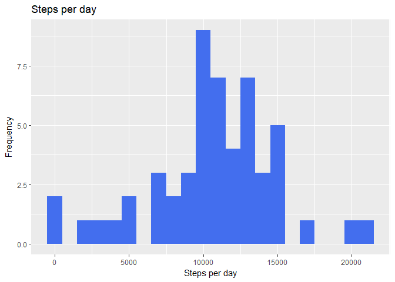
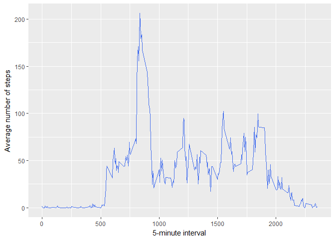
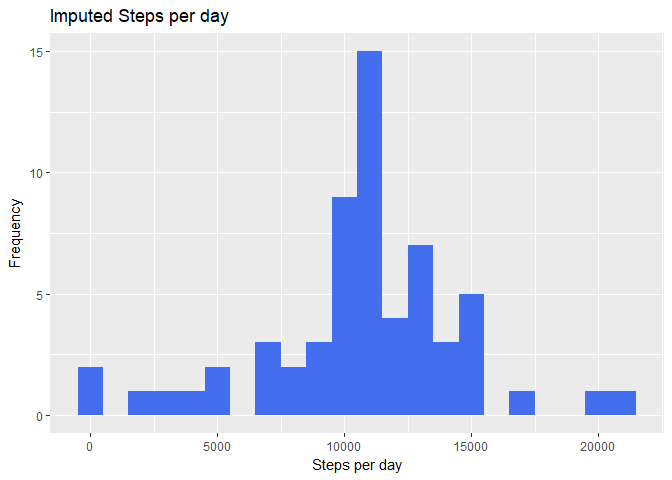
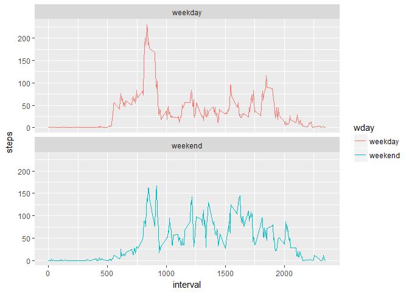

set directory and read in file and Convert date from character to date


```r
library(dplyr)
```

```
## Warning: package 'dplyr' was built under R version 3.3.3
```

```
## 
## Attaching package: 'dplyr'
```

```
## The following objects are masked from 'package:stats':
## 
##     filter, lag
```

```
## The following objects are masked from 'package:base':
## 
##     intersect, setdiff, setequal, union
```

```r
library(ggplot2)
```

```
## Warning: package 'ggplot2' was built under R version 3.3.3
```

```r
library(lubridate)
```

```
## Warning: package 'lubridate' was built under R version 3.3.3
```

```
## 
## Attaching package: 'lubridate'
```

```
## The following object is masked from 'package:base':
## 
##     date
```

```r
library(stats)
setwd("~/Data Science/Reproducible data/Week 2/data")
activity1 <- read.csv("activity.csv",header=TRUE, sep=",")
activity1$date <- mdy(activity1$date)
str(activity1)
```

```
## 'data.frame':	17568 obs. of  3 variables:
##  $ steps   : int  NA NA NA NA NA NA NA NA NA NA ...
##  $ date    : Date, format: "2012-10-01" "2012-10-01" ...
##  $ interval: int  0 5 10 15 20 25 30 35 40 45 ...
```

Calculate mean number of steps taken per day and create a histogram


```r
  tsteps <- activity1 %>%
  filter(!is.na(steps)) %>%
  group_by(date) %>%
  summarize(steps = sum(steps)) %>%
  print
```

```
## Warning: package 'bindrcpp' was built under R version 3.3.3
```

```
## # A tibble: 53 x 2
##    date       steps
##    <date>     <int>
##  1 2012-10-02   126
##  2 2012-10-03 11352
##  3 2012-10-04 12116
##  4 2012-10-05 13294
##  5 2012-10-06 15420
##  6 2012-10-07 11015
##  7 2012-10-09 12811
##  8 2012-10-10  9900
##  9 2012-10-11 10304
## 10 2012-10-12 17382
## # ... with 43 more rows
```
Create histogram of steps


```r
png("p1.png", width=480, height=480) 
p1 <- ggplot(tsteps, aes(x = steps)) +
  geom_histogram(fill = "royalblue2", binwidth = 1000) +
  labs(title = "Steps per day", x = "Steps per day", y = "Frequency")
print(p1)
dev.off()
```

```
## png 
##   2
```

```r
print(p1)
```

<!-- -->
Calculate mean and median steps per day


```r
MeanSteps <- mean(tsteps$steps, na.rm = TRUE)
MedianSteps <- median(tsteps$steps, na.rm = TRUE)
MeanSteps
```

```
## [1] 10766.19
```

```r
MedianSteps
```

```
## [1] 10765
```
Average daily activity pattern
Make a time series plot of the 5 minute interval and 
Find the interval with the max number of steps


```r
interval <- activity1 %>%
  filter(!is.na(steps)) %>%
  group_by(interval) %>%
  summarize(steps = mean(steps))
print
```

```
## function (x, ...) 
## UseMethod("print")
## <bytecode: 0x000000000e3d53d8>
## <environment: namespace:base>
```
Create Time Series Plot of 5 minute Interval


```r
png("p2.png", width=480, height=480) 
p2 <- ggplot(interval, aes(x=interval, y=steps)) +
  geom_line(color = "royalblue2") + xlab("5-minute interval") +
  ylab("Average number of steps") 
print(p2)
dev.off()
```

```
## png 
##   2
```

```r
print(p2)
```

<!-- -->
Which interval has on average the maximum number of steps


```r
interval[which.max(interval$steps),]
```

```
## # A tibble: 1 x 2
##   interval steps
##      <int> <dbl>
## 1      835   206
```
Imputing missing values

1.Calculate and report the total number of missing values in the dataset (i.e. the total number of rows with  NAs)


```r
numMissingValues <- length(which(is.na(activity1$steps)))
numMissingValues
```

```
## [1] 2304
```
2.Devise a strategy for filling in all of the missing values in the dataset. The strategy does not need to be sophisticated. For example, you could use the mean/median for that day, or the mean for that 5-minute interval, etc.

Missing data will be imputed by replacing the missing value with the mean steps per day.

3.Create a new dataset that is equal to the original dataset but with the missing data filled in


```r
Imputedsteps <- activity1
str(Imputedsteps)
```

```
## 'data.frame':	17568 obs. of  3 variables:
##  $ steps   : int  NA NA NA NA NA NA NA NA NA NA ...
##  $ date    : Date, format: "2012-10-01" "2012-10-01" ...
##  $ interval: int  0 5 10 15 20 25 30 35 40 45 ...
```

Calculate mean per interval and replace NA with data


```r
avgPerinterval <- tapply(Imputedsteps$steps, Imputedsteps$interval, mean, na.rm=TRUE)
MissstepVal <- is.na(Imputedsteps$steps) 
Imputedsteps$steps[MissstepVal] <- avgPerinterval[as.character(Imputedsteps$interval[MissstepVal])]
```
Recalculate total steps on imputed data


```r
TotImputedsteps <- Imputedsteps %>%
  filter(!is.na(steps)) %>%
  group_by(date) %>%
  summarize(steps = sum(steps)) %>%
  print
```

```
## # A tibble: 61 x 2
##    date       steps
##    <date>     <dbl>
##  1 2012-10-01 10766
##  2 2012-10-02   126
##  3 2012-10-03 11352
##  4 2012-10-04 12116
##  5 2012-10-05 13294
##  6 2012-10-06 15420
##  7 2012-10-07 11015
##  8 2012-10-08 10766
##  9 2012-10-09 12811
## 10 2012-10-10  9900
## # ... with 51 more rows
```

4.Make a histogram of the total number of steps taken each day and Calculate and report the mean and median total number of steps taken per day. Do these values differ from the estimates from the first part of the assignment? What is the impact of imputing missing data on the estimates of the total daily number of steps?


```r
png("p3.png", width=480, height=480) 
p3 <- ggplot(TotImputedsteps, aes(x = steps)) +
  geom_histogram(fill = "royalblue2", binwidth = 1000) +
  labs(title = "Imputed Steps per day", x = "Steps per day", y = "Frequency")
print(p3)
dev.off()
```

```
## png 
##   2
```

```r
print(p3)
```

<!-- -->
Calculate mean and median of imputed steps


```r
meanImputedsteps <- mean(TotImputedsteps$steps, na.rm = TRUE)
medianImputedsteps <- median(TotImputedsteps$steps, na.rm = TRUE)

meanImputedsteps
```

```
## [1] 10766.19
```

```r
medianImputedsteps
```

```
## [1] 10766.19
```
What is the impact of imputing missing data on the estimates of the total daily number of steps?

We can see that now the mean and median are the same.

Are there differences in activity1 patterns between weekdays and weekends?

For this part the weekdays() function may be of some help here. Use the dataset with the filled-in missing values for this part.

1.Create a new factor variable in the dataset with two levels - "weekday" and "weekend" indicating whether a given date is a weekday or weekend day


```r
Imputedsteps$day <- weekdays(as.Date(Imputedsteps$date))

Imputedsteps$wday <- ifelse(weekdays(Imputedsteps$date) %in% c("Saturday", "Sunday"), "weekend", "weekday")
str(Imputedsteps)
```

```
## 'data.frame':	17568 obs. of  5 variables:
##  $ steps   : num  1.717 0.3396 0.1321 0.1509 0.0755 ...
##  $ date    : Date, format: "2012-10-01" "2012-10-01" ...
##  $ interval: int  0 5 10 15 20 25 30 35 40 45 ...
##  $ day     : chr  "Monday" "Monday" "Monday" "Monday" ...
##  $ wday    : chr  "weekday" "weekday" "weekday" "weekday" ...
```
2.Make a panel plot containing a time series plot (i.e. type = "l") of the 5-minute interval (x-axis) and the average number of steps taken, averaged across all weekday days or weekend days (y-axis). See the README file in the GitHub repository to see an example of what this plot should look like using simulated data.


```r
ImputedStepsW <- Imputedsteps %>%
  group_by(interval, wday) %>%
  summarise(steps = mean(steps))
png("p4.png", width=480, height=480) 
 p4 <- ggplot(ImputedStepsW, aes(x=interval, y=steps, color = wday)) +
  geom_line() +
  facet_wrap(~wday, ncol = 1, nrow=2)
 print(p4)
 dev.off()
```

```
## png 
##   2
```

```r
 print(p4)
```

<!-- -->
